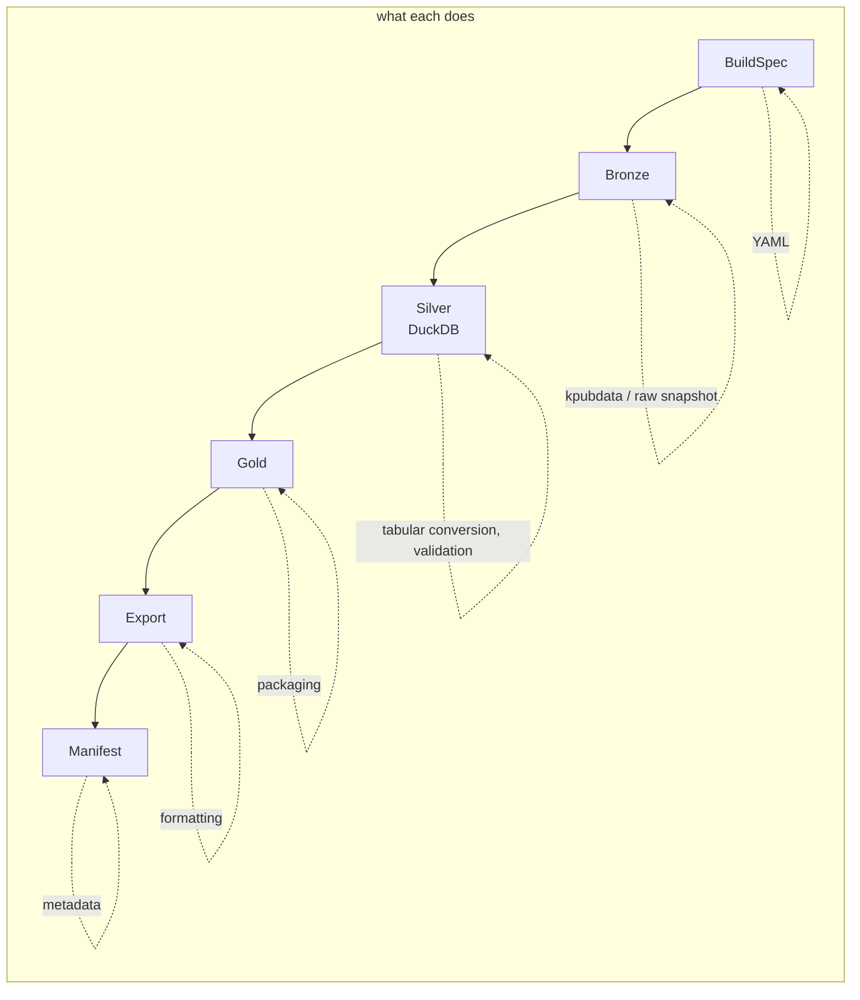
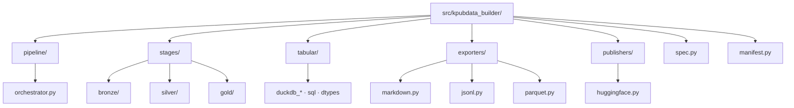
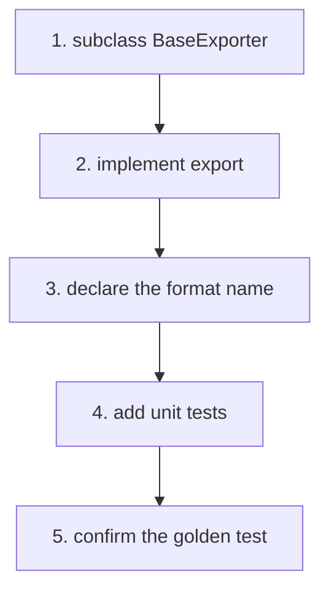

# AGENTS.md — kpubdata-builder

> **[POLICY.md](https://github.com/yeongseon/kpubdata/blob/main/docs/governance/POLICY.md)
> is the single canonical source for project-management and review policy.** Epic,
> Issue, Priority, Review Level, Verification and Release rules come from there.
> This file keeps only what is specific to this repository — build commands and
> directory rules. POLICY.md wins any conflict.

## Mission

Implement KPubData Builder: the orchestration and artifact-pipeline layer that
runs on top of `kpubdata`.

## Ground rules

- Do not reimplement `kpubdata`'s provider logic here.
- Keep build specs declarative.
- Prefer deterministic behaviour over anything that looks like magic.
- Keep exporters pluggable.
- Every build produces a manifest.
- Validation fails fast and says why.

## Language policy

> [kpubdata ADR 0003](https://github.com/yeongseon/kpubdata/blob/main/docs/adrs/0003-language-policy.md)
> is canonical. The evidence (measurements across ten Korean OSS projects) and the
> rejected alternatives are there.

**Titles are English; bodies are free.** Titles show up in lists, searches and
release notes.

| Area | Language |
|---|---|
| Code identifiers, comments, docstrings | English |
| Commit titles (= PR titles) | English — a squash merge makes the PR title the commit title |
| Commit bodies (= PR bodies) | Korean or English — the squash body is the PR body ([POLICY 2.1.3](https://github.com/yeongseon/kpubdata/blob/main/docs/governance/POLICY.md), kpubdata#743) |
| **PR titles** | English (Conventional Commits) — a squash merge turns it into a commit |
| CHANGELOG and release notes | English |
| **Governance documents** (`AGENTS.md`, `CONTRIBUTING.md`) | English |
| **Implementation contracts** (`PROVIDER_ADAPTER_CONTRACT.md`, `API_SPEC.md`) | English |
| **Design rationale** (`VALIDATION.md`, `ARCHITECTURE.md`, ADRs) | Korean |
| **README** | Korean first, with an English section in the same file |
| **Issue titles** | English |
| Issue bodies | Korean or English |
| PR bodies and review comments | Korean or English |
| Korean-domain documents (활용신청, 공공누리 procedures) | Korean |
| User-visible string literals | **Out of scope** — runtime behaviour, decided separately |

Operating rules:

- Answer an issue in the language it was written in.
- Write `good first issue` in English, or in both.
- **Do not let English block a contribution.** If a title is hard to write in
  English, open it in Korean and say so — triage and review will sort it out.

### Comments and docstrings are gated, not merely requested

The rule above went unenforced long enough to accumulate 3,878 Korean comments and
docstrings across 255 files. `scripts/check_korean_comments.py` is a ratchet: it
freezes the current per-file count and fails only when a count grows, or when a
file absent from the baseline has any. Write new code in English; the existing
debt is paid down separately (#710).


## 확인은 기계가 한다

[POLICY 18.2](https://github.com/yeongseon/kpubdata/blob/main/docs/governance/POLICY.md) and [VERIFICATION.md](https://github.com/yeongseon/kpubdata/blob/main/docs/governance/VERIFICATION.md) are canonical. Three rules
carry most of the weight:

- **A sentence with a number in it comes from a command.** Run it in the same breath
  and paste the output. A figure recalled from memory is not a figure.
- **Sweep with `git ls-files`, not with paths you chose.** Ask the repository what it
  has. A hand-written path list is how `__tests__/` got missed.
- **A rule without a gate is a wish.** When you add a rule, add the command that
  checks it, wire it into CI, and write the test that shows it failing. Without the
  third, nobody knows the gate works.
- **An absent check is not a failure — it is a stop.** A required status check no
  workflow produces leaves every pull request BLOCKED for ever, because GitHub waits
  for it rather than reporting it. The way past is `--admin`, which skips every other
  check too. Require the one aggregate `CI gate` job, never a matrix-suffixed name,
  and run `scripts/check_required_checks.py` (in kpubdata) after touching a matrix.

Existing debt is frozen with a **ratchet** — the baseline holds today's per-file
count and the check fails only when a count grows. Fixing everything first means
starting nothing.

Say "done" with the command's output. If tests failed, paste the failure. If a step
was skipped, say it was skipped.

## Labels — what an agent applies

**[POLICY.md](https://github.com/yeongseon/kpubdata/blob/main/docs/governance/POLICY.md) sections 2.1, 2.1.1 and 2.1.2 are the label reference.**
This file deliberately does not copy the table: a second copy goes stale, and the
first draft of this section already dropped the Severity axis that POLICY defines.

What is specific to agents:

- A new issue carries **at least one `epic:*`**. Its title starts with a
  Conventional Commits type — `fix(localdata): empty wrapper becomes a phantom row` —
  and the `type:*` label follows from the title (POLICY 2.1.3). **Never set `type:*`
  by hand**, and change the title rather than the label when the type was wrong.
- Pull request titles use the same types; the `PR title` check fails otherwise. The
  allowed list lives in kpubdata's `scripts/conventional_title.py`, and the rules in
  kpubdata's POLICY 2.1.3 — the one place all three repositories read. Merges are
  squash-only, so the PR title becomes the commit title on `main`. Do not put an issue
  number in a PR title; write `Closes #N` in the body.
- Leave Priority off when there is no evidence for it. POLICY 8 requires
  `Impact:`, `Blocks:` and `Evidence:` for High and above, and a rating without
  evidence is a wrong rating.
- Do not prefix a title with `GOV-01:` or `WH-03:`. Those are serial numbers from
  a backlog document, not the issue's name. The type is the only prefix.
- A pull request labelled `review:R3` cannot merge until someone other than its
  author, with write access, approves it: the required `R3 review` check fails until
  then (kpubdata POLICY 14.1). The author's own approval, a bot's, and one followed by
  a request for changes do not count. Ask for the review; do not remove the label.

What an agent does not do:

- Promote to `priority:high` or `priority:critical` — that is a person's judgement
  (POLICY 8, 14).
- Create a label that POLICY's table does not list. Adding one goes through
  `epic:governance`.
- Lower a `review:*` level.
- Create an Epic issue. Epic is a label (POLICY 4.1).
- Substitute `P0`/`P1`/`P2` mechanically for `priority:*`. POLICY 8 requires a
  re-rating from zero, so that a wrong priority does not survive under a new name.

## Branch rules

- The default branch is `main`. **Never push to `main` directly.** Branch
  protection now enforces this, so a direct push is refused rather than merely
  discouraged.
- Always work on a feature branch and open a PR.
- Branch names: `feat/issue-<number>-<short-description>`,
  `fix/issue-<number>-<short-description>`, `docs/<short-description>`.
- Never force-push to `main`. Never delete `main`.
- Do not rename or delete a branch you did not create.
- If a git operation is not obviously safe, **ask instead of guessing.**

## Releases

Cadence and order live in [kpubdata's compatibility.md §5.1](https://github.com/yeongseon/kpubdata/blob/main/docs/compatibility.md#release-cadence);
who may do what lives in POLICY 14. This section keeps only what applies to an
agent.

- **Builder and Studio release once a month** (kpubdata#685): only in the week holding
  the month's last Thursday, in KST — Builder by Wednesday, Studio by Thursday.
  `release.yml` runs kpubdata's `release-window` gate (`policy: monthly`) first and
  refuses anything else. A critical patch (a security fix or a release-blocking
  defect) may go out at any time and must name its issue: `critical_patch` +
  `critical_issue` on a dispatch, or a `Critical-Patch: #N` line in the release pull
  request's body.
- **Release week is a freeze.** From the Monday of that week until kpubdata-studio is
  released, open only release pull requests against `main`: version, CHANGELOG,
  dependency pin, compatibility documents, or a fix for a failing release gate. Other
  work waits on its branch. A kpubdata pin raise may merge at any time.
- **kpubdata is not on this train.** It releases on demand, at most once every seven
  days. Never recommend a release outside these rules to unblock work: build against
  kpubdata `main` in the early-warning job, and raise the pin when kpubdata releases.
- **Prepare, do not release.** An agent may tidy the CHANGELOG's Unreleased section,
  run a release workflow with `dry_run`, and draft the version and pin pull requests.
  Pushing a tag, creating a GitHub Release, approving the PyPI environment and
  changing what a release contains are a person's (POLICY 14).
- **Propose the bump from the CHANGELOG, with the reason.** In 0.x, a breaking change
  or a new feature is minor; fixes alone are patch.
- **Write what a release changes under `## [Unreleased]` in `CHANGELOG.md`, as you
  merge it.** The prepare job dates that section and the release job publishes it as
  the notes. An empty `[Unreleased]` stops the release — Studio included, when it only
  follows Builder's version: say so in a line.
- **Builder and Studio share one version** (ADR 0004). They ship as one application,
  so a release that only changed one of them still raises both, and neither skips a
  month alone.
- **Target Release is a month (`2026-10`), not a version.**

## Build order

1. The spec model
2. Medallion pipeline orchestration
3. Source execution through `kpubdata`
4. The tabular engine (DuckDB, ADR 0021) and Silver validation
5. The artifact model and Gold packaging
6. The Markdown exporter
7. The HuggingFace layout exporter
8. Stage-aware publish hooks

## Test expectations

- Unit tests for spec validation
- Stage-aware tests for Bronze/Silver/Gold promotion
- Golden tests for Markdown output
- Manifest contract tests
- Fixture-based source execution tests

---

## How this project fits together

`kpubdata` fetches; this repository turns what it fetched into published
artifacts. Collection, validation and packaging each happen in a named stage, and
every build leaves a manifest describing what came out.

### Vocabulary

| Term | Meaning |
| :--- | :--- |
| **BuildSpec** | Declares what to collect, how to shape it and where it goes |
| **Bronze** | First stage: raw collection results and the source snapshot |
| **Silver** | Middle stage: tabular conversion, validation, statistics, preview |
| **Gold** | Final internal stage: partitioning and an export-ready package |
| **Artifact** | Something a build produced (a file, usually) |
| **Manifest** | The specification of what a build produced — version, timestamps, digests |
| **Tabular engine** | The one canonical tabular engine: DuckDB (ADR 0021, #864–#877). Nothing under `src/` imports Polars (#876). Only the legacy publish path (`scripts/pipeline/`, the `legacy-publish` extra) keeps Polars until it is retired (ADR 0018, ADR 0021 D1); the tests keep the old Polars engine in `tests/support/` as an oracle |
| **Exporter** | Converts data into a format (Markdown, JSONL, Parquet, HuggingFace) |
| **Publisher** | Uploads a finished artifact somewhere (GitHub, HF Hub) |
| **Golden Test** | Compares current output against a stored known-good file |

### Pipeline flow



Silver, Gold, quality rules and queries all run on DuckDB (ADR 0021): Bronze's JSONL
is loaded into a table, each stage is SQL over it, and Silver and Gold are written as
Parquet with their Builder dtypes in the file's metadata.

```text
[BuildSpec] -> [Bronze: raw collection] -> [Silver: tabular conversion and validation]
            -> [Gold: packaging] -> [Export: formatting] -> [Manifest: metadata]
```

## Agent coding rules

### Prompts that work

- "Add a `CSVExporter`. Follow `exporters/base.py` and implement `ExportModel`."
- "Add filter conditions to the `BuildSpec` model."

### Forbidden

- **Duplicating `kpubdata` logic.** Parsing belongs there. Here you only handle
  what came back.
- **Unclear output paths.** Where a file is written is always explicit.
- **A build without a manifest.** Every build output includes `manifest.json`.
- **Polars under `src/`.** The canonical tabular engine is DuckDB (ADR 0021), and
  `tests/unit/test_without_polars.py` fails if any module of the package loads Polars.
  Tabular code goes through `tabular/duckdb_runtime.py` (connections, resource limits,
  temp directories), `tabular/sql.py` (identifier quoting and parameter binding —
  never interpolate user data into SQL) and `tabular/dtypes.py` (Builder-owned dtype
  names); `tests/parity/` holds the baseline a change must match or explain.
- **Leaking kpubdata's vocabulary into the contract.** Builder owns the wire
  vocabulary (`service/vocabulary.py`, #831); map kpubdata values explicitly and
  use only kpubdata's public API (`scripts/check_kpubdata_imports.py`).

### Before handing work back

- [ ] Does `uv run ruff check .` pass?
- [ ] Are the Bronze/Silver/Gold responsibilities kept distinct in both the code
  and the docs?
- [ ] Does the new exporter have unit tests?
- [ ] If the change needs a stage-aware test or a fixture, is it there?
- [ ] Does a golden test confirm the output is what you intended?

## Directory layout



```text
src/kpubdata_builder/
├── pipeline/        # medallion stage flow control
├── stages/          # bronze, silver, gold implementations
├── tabular/         # tabular processing on DuckDB (ADR 0021)
├── exporters/       # format conversion (Markdown, JSONL, Parquet)
├── publishers/      # artifact upload (HF, GitHub)
├── service/         # HTTP service mode (app.py, http.py, auth.py)
├── store/           # BuildIndex — derived SQLite index (ADR 0003)
├── warehouse/       # table catalog: immutable snapshots, CAS pointer (#699)
├── spec/            # BuildSpec definition and validation
└── manifest/        # manifest generation
```

### Which file to change

- **A new output format**: add a file under `exporters/`.
- **Uploading somewhere new**: add logic under `publishers/`.
- **Changing stage promotion rules**: review `pipeline/` and `stages/` together.

## Adding an exporter



1. Subclass `BaseExporter` from `exporters/base.py`.
2. Implement `export(self, artifacts: List[Artifact]) -> List[Path]`.
3. Declare the supported format name as a class variable.
4. Add tests to `tests/unit/test_exporters.py`.

### What a golden test is

When the output is text, such as Markdown, a golden test compares it line for line
against a stored known-good file. It catches a formatting change that no assertion
would notice.

---

## Related documents

### In this repository

| Document | What it covers |
| :--- | :--- |
| [CONTRIBUTING.md](./CONTRIBUTING.md) | How to contribute |
| [ARCHITECTURE.md](./ARCHITECTURE.md) | System architecture |
| [DOMAIN_MODEL.md](./DOMAIN_MODEL.md) | Domain model |
| [EXPORT_MODEL.md](./EXPORT_MODEL.md) | Export model |
| [API_CONTRACT.md](./API_CONTRACT.md) | API contract |
| [PRD.md](./PRD.md) | Product requirements |
| [ROADMAP.md](./ROADMAP.md) | Roadmap |
| [CREDENTIAL_SURFACE.md](https://github.com/yeongseon/kpubdata-builder/blob/main/docs/CREDENTIAL_SURFACE.md) | Every place a user key can persist |
| [SECURITY.md](https://github.com/yeongseon/kpubdata-builder/blob/main/SECURITY.md) | Security policy and known limits |

### KPubData product family

| Repository | Document | What it covers |
| :--- | :--- | :--- |
| [kpubdata](https://github.com/yeongseon/kpubdata) | [AGENTS.md](https://github.com/yeongseon/kpubdata/blob/main/AGENTS.md) | Core agent guide |
| [kpubdata-studio](https://github.com/yeongseon/kpubdata-studio) | [AGENTS.md](https://github.com/yeongseon/kpubdata-studio/blob/main/AGENTS.md) | Studio agent guide |
